# Trajectory Planning for Autonomous Gliders Using Stable Sparse RRT in Two and Three-Dimensional Environments

Sebastian Escobar sebastian.escobar@colorado.edu

Department of Aerospace Engineering Sciences

University of Colorado Boulder

## Abstract

This report presents an implementation of the Stable Sparse RRT* (SST*) algorithm for planning dynamically feasible trajectories of a glider in both two-dimensional and three-dimensional environments. In the two-dimensional analysis, the methodology incorporates obstacles and wind disturbances, analyzes a variety of cost functions, and then evaluates SST* performance without explicit goal sampling. The three-dimensional analysis will focus on a more detailed examination of cost functions and evaluation of the optimality of the SST*. The results show the adaptability of SST* in different spatial dimensions, from the ability to optimize glide range to maintaining trajectory stability without explicit goal-directed strategies. This comprehensive approach expands the sphere of applicability and efficiency of SST* in complex planning problems.

## 1 Introduction

Autonomous planning for unmanned gliders is challenging due to complex aerodynamic conditions, wind disturbances, high dimensional state space, and environmental constraints. Sampling-based motion planners like RRT have found success in such problems, but variants such as Stable Sparse RRT* (SST*) offer improved asymptotic optimality and sparser tree representations, leading to more efficient exploration and solution refinement.

This project focuses exclusively on SST* and its performance under different planning objectives within both two-dimensional and three-dimensional environments. In the two-dimensional case, I incorporate obstacles and wind disturbances to simulate realistic flight conditions, analyze various cost functions, and evaluate SST* performance without relying on explicit goal sampling. This approach demonstrates how SST* can achieve desired behaviors, such as maximizing glide range and avoiding obstacles, solely through cost-based guidance. 

In the three-dimensional analysis, the study extends to a more complex spatial domain, where I analyze cost functions and assess the asymptotic optimality of SST*. By showing the two-dimensional and three-dimensional cases, this project reveals how SST* adapts to varying spatial complexities and maintains optimal performance across different dimensional contexts. The comprehensive evaluation underscores the planner's versatility and effectiveness in diverse planning scenarios.

## 2 Problem Description

This study investigates the application of the Stable Sparse RRT* (SST*) algorithm for planning dynamically feasible trajectories of a glider in both two-dimensional (2D) and three-dimensional (3D) environments. The problem is approached through two distinct scenarios, each with its unique set of objectives and constraints.

Consider a glider navigating a three-dimensional environment. The state of the glider is represented by a 12-dimensional vector:

[x,y,z,φ,θ,ψ,u,v,w,p,q,r]

In the two-dimensional case, the glider navigates within a planar environment (x-z plane) and its control space is restricted to elevator deflection. Due to the nature of the aircraft's dynamics, this choice of control space will only affect the glider longitudinally, effectively simplifying the dynamics at hand.

SST* is evaluated in scenarios where explicit goal sampling is disabled. Instead of relying on predefined goal states, the planner utilizes cost functions to autonomously discover optimal trajectories that maximize glide range and maintain stability.

In the three-dimensional case, the glider navigates within a bounded space defined by the \(x\), \(y\), and \(z\) axes and its control space is composed of aileron, rudder and elevator deflections.

To assess the asymptotic optimality of SST* in three dimensions, a series of experiments are conducted where the algorithm's parameters are systematically varied, and the number of iterations is increased. By reducing the pruning thresholds and allowing more iterations, SST* is observed to converge toward optimal trajectories in terms of path length and adherence to cost objectives. This evaluation confirms SST*'s ability to approach optimal solutions as computational resources and planning horizons are extended.

## 3 Methodology

### 3.1 Overview

This section outlines the implementation and analysis of the Stable Sparse RRT* (SST*) algorithm in both two-dimensional and three-dimensional environments. The methodology is divided into two primary cases:

• Two-Dimensional Case: Incorporates obstacles and wind disturbances, analyzes various cost functions, and evaluates SST* performance without explicit goal sampling.

• Three-Dimensional Case: Focuses on cost function analysis and assesses the asymptotic optimality of SST*.

### 3.2 Algorithm: SST*

Stable Sparse RRT* (SST*) is a sampling-based planner that can achieve asymptotic optimality while maintaining a sparse subset of nodes in the state space. It incrementally explores by randomly sampling states, extending from promising nodes, and pruning suboptimal trajectories. By focusing on a smaller, well-chosen set of states, SST* can converge to high-quality solutions efficiently. 

In some analyses, I incorporate explicit goal sampling to guide SST* toward a known goal region. In others, I disable goal sampling entirely, relying solely on cost functions to lead the planner toward desirable trajectories. This dual approach allows me to compare the effectiveness of traditional goal-centric planning against purely cost-driven methods. Additionally, I showcase the potential of using this planner.

### 3.3 Dynamics and Environment
I model the glider's flight as a 6-DOF rigid-body system with nonlinear dynamics. The state includes position, orientation, linear velocities, and angular rates. Equations of motion include the unsteady aerodynamic forces and moments, gravitational acceleration, and moments of inertia. I integrate these dynamics using a 4th-order Runge-Kutta method.

The environment is a three-dimensional bounded space. Obstacles, if any, are represented as Axis-Aligned Bounding Boxes (AABBs). Collision checking is performed by interpolating along trajectory segments and testing for geometric intersections. A uniform wind in a specified region of the x-z plane can also be present, which changes the glider's relative airflow and hence the set of feasible trajectories.

Due to time and plotting constraints, I was only able to implement obstacles and wind disturbances in a 2D environment. Nonetheless, the code is set up to handle wind and obstacles in 3D. 

### 3.4 Cost Functions

I implemented various cost functions tailored to different planning objectives:

• Goal-centric Cost: When goal sampling is active, this cost penalizes distance to the target region, guiding SST* toward achieving a known end state.

• Range-centric Cost (No Explicit Goal): In analyses without goal sampling, I use a cost function that rewards forward progress (e.g., maximizing horizontal range). SST* then naturally discovers long-distance glide trajectories without explicit guidance.

• Obstacle Penalties: Introduce penalties for trajectories passing near obstacles, encouraging safer, collision-free paths.

• Pitch-rate Penalties: Discourage high pitch-rate maneuvers, promoting smoother and more stable flight profiles.

• Altitude Cost: Penalizes excessive altitude loss, encouraging the glider to maintain higher altitudes.

By selectively enabling or disabling goal sampling and tuning these cost functions, I can compare how SST* behaves under different guidance paradigms and environmental constraints.

### 3.5 Implementation Details

This project is implemented solely in C++ with no external motion planning or simulation libraries. All functionalities are self-written, including the state-space representation, dynamics integration, sampling, collision checking, tree management, cost evaluation, and environment modeling. Highlights of the implementation include the following:

• Class Design: The code is divided into multiple classes and header files, each dedicated to a specific component of the planning pipeline. For instance:

– Environment.h/cpp: Defines the 3D bounded workspace, obstacles (AABBs), and wind fields. It also provides methods to sample random states and controls, as well as collision checks along interpolated trajectory segments.

– State.h/cpp and ControlSurfaces.h/cpp: Represent the glider’s continuous state and control inputs, keeping track of positions, velocities, angles, and control surface deflections.

– Dynamics.h/cpp: Implements a 6-DOF rigid-body flight model using nonlinear aerodynamic equations. It includes a custom 4th-order Runge-Kutta integrator to propagate states, compute forces and moments, and apply them over a chosen time step.

– Graph.h/cpp and Node.h: Manage the search tree structure. Nodes store states, controls, durations, and costs. The graph provides nearest-neighbor queries, node insertion, and rewiring functionalities.

– Witness.h/cpp: Maintains a set of "witness" nodes that help enforce sparsity. This ensures that SST* focuses on improving promising trajectories rather than redundantly exploring already covered regions of the state space.

• Sampling and Goal Biasing: State and control sampling routines are implemented directly in the \textit{Environment} class, using internally defined random number generators and distributions. For experiments with a known goal, a subset of samples is biased toward the goal region. For cost-driven scenarios, the sampling remains uniform, and only the cost function guides the search toward optimal trajectories.

• Custom Cost Evaluation: The cost functions—goal distance, horizontal range, obstacle proximity, pitch-rate penalties, and altitude retention—are all computed directly in the code without external dependencies. Each cost metric is computed on-the-fly as states are generated and integrated. Adjusting the relative weights in the code allows quick experimentation with different planning objectives.

• Collision Checking and Interpolation: While this method is not the most sophisticated or computationally optimal—more advanced collision detection techniques could reduce the risk of missing narrow passages or small obstacles—it was chosen to simplify the implementation and reduce computational overhead.

This bottom-up approach lets me achieve complete transparency, controllability, and flexibility in the planning process. It is easy to compare different modes of operation, such as goal-based versus purely cost-driven, by toggling flags and changing weight parameters. It also allows careful integration of wind fields and obstacles to test the planner's robustness under various environmental conditions.

## 4 Results

### 4.1 Using SST* For Glide Range Optimization

In these experiments, the maximum achievable glide range was determined iteratively. Starting from a chosen target x-position, I iteratively increased the goal distance and reran the simulation until the glider could no longer reach the assigned target. This process outlined the physical and dynamic limitations of the system.

In Figure 1, the planner biases samples 5% of the time toward a goal set about 200m beyond this experimentally determined maximum glide range. In contrast, Figure 2 shows an example with no explicit goal sampling, relying solely on a cost function to guide the glider’s trajectory. Despite these differing approaches, the glider ends up reaching a similar final position in both cases. This outcome shows that a long, stable glide near the dynamical limit can be achieved either by incorporating sparse goal-directed sampling or by allowing SST* to naturally discover the trajectory through a carefully designed cost function alone.

  

Figure 1: SST* Trajectory and elevator deflection over time with 5\% goal sampling. The goal is placed approximately 200m beyond the maximum glide range, which was determined iteratively by incrementally increasing the target distance until the glider could no longer reach it.

  

Figure 2: SST* Trajectory and elevator deflection over time without any goal sampling. The planner relies solely on the cost function to guide the glider, yet achieves a similar final position, demonstrating that a carefully designed cost can replicate the performance obtained with explicit goal sampling.

### 4.2 Incorporation of Obstacle Avoidance

In these experiments, all previously defined cost functions (goal-centric, altitude, obstacle avoidance, and pitch-rate penalties) were active, and a known goal state was consistently sampled throughout the planning process. With a persistent definition of the goal and the incorporation of obstacle constraints, the planner keeps seeking to approach the target, taking into consideration altered environmental conditions.

Figures 3–6 show the robustness of the selected weights of the cost function. Even as the environment becomes more complex, including the introduction of narrow passages and additional obstacles, SST* still identifies trajectories that reach the goal. The careful tuning of the cost weights ensures that the planner appropriately balances conflicting objectives—maintaining altitude, avoiding obstacles, minimizing pitch-rate excursions, and ultimately converging on the goal region—resulting in resilient performance under a variety of challenging scenarios.

  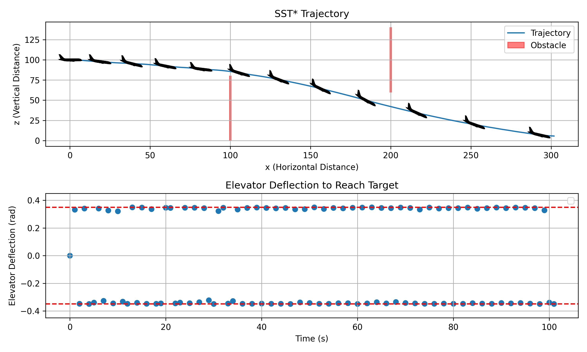

Figure 3: SST* trajectory and elevator deflection over time, illustrating how balanced cost function weights enable goal attainment despite environmental challenges.

  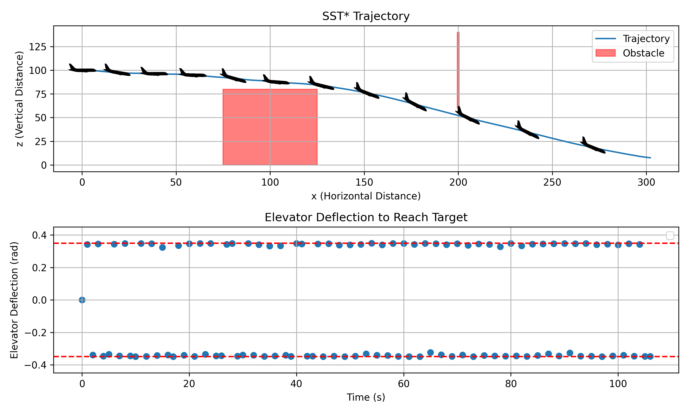

Figure 4: SST* trajectory and elevator deflection over time, illustrating how balanced cost function weights enable goal attainment despite environmental challenges.

  

Figure 5: SST* trajectory and elevator deflection over time, illustrating how balanced cost function weights enable goal attainment despite environmental challenges.

  

Figure 6: SST* trajectory and elevator deflection over time, illustrating how balanced cost function weights enable goal attainment despite environmental challenges.

### 4.3 Influence of Wind Disturbances

In the following experiments, Figures 7–11 introduce a steady wind field into the environment to assess how well the planner can adapt under changing conditions of flight. With the same set of cost functions active-goal-centric, altitude, obstacle avoidance, and pitch-rate penalties-the presence of wind challenges efficient trajectory maintenance by the glider towards the target.

For that, the relative weights in the cost functions were a little adjusted, so the planner keeps the altitude and pitch behavior when facing head- and tailwind. The figures illustrate, next to the resulting trajectories, how the elevator deflection-an input directly affecting the glider's pitch angle-varies over time. By analyzing these changes in pitch, we see how the planner makes up for environmental disturbances with carefully weighted costs that continue to tune its control inputs.

Even with a significant 20 m/s headwind or tailwind, SST* converges on feasible solutions that reach the goal. This demonstrates that the planner can successfully counteract adverse conditions and preserve near-optimal performance, all while adhering to strict cost-based criteria for altitude, obstacle avoidance, and pitch-rate stability.

  

Figure 7: SST* Trajectory and Elevator deflection over time. No wind is added in this simulation.

  

Figure 8: SST* Trajectory and Elevator deflection over time. There is a 20m/s headwind in this simulation.

  

Figure 9: SST* Trajectory and Elevator deflection over time. There is a 20m/s tailwind in this simulation.

  

Figure 10: SST* Trajectory and Elevator deflection over time. There is a 4m/s upward wind component in this simulation.

  

Figure 11: SST* Trajectory and Elevator defection over time. There is a 4m/s upward wind component in this simulation.

### 4.4 Exploring Different Cost Functions for SST*

In these experiments, I investigate how fine-tuning of individual cost functions influences the planner’s behavior under varying conditions. By putting selective emphasis on different aspects, for instance, obstacle avoidance or pitch rate minimization, SST* can change the trajectory and control inputs it provides to meet the desired objectives.

Obstacle Proximity Cost Function

In fact, with the obstacle proximity cost activated, there is a much stronger trend in control input adjustment by the glider when it approaches a dangerous region. As soon as the planner recognizes that the trajectory has brought the aircraft too close to an obstacle, its response becomes a rapid deflection of the elevator with a corresponding deviation of the flight path. These sharp turns allow the glider to steer well away from obstacles while making headway toward the goal. The trajectories obtained in this case -as illustrated in Figures 12-13- reveal that the inclusion of this cost term favors dynamic avoidance maneuvers.

  

Figure 12: SST* trajectory and elevator deflection over time, illustrating how the planner responds when approaching obstacles. By incorporating an obstacle proximity cost, the algorithm adjusts the glider’s flight path to maintain a safe distance.

  

Figure 13: SST* trajectory and elevator deflection over time, illustrating how the planner responds when approaching obstacles. By incorporating an obstacle proximity cost, the algorithm adjusts the glider’s flight path to maintain a safe distance.

Pitch Rate Cost Function

In scenarios that emphasize the minimization of pitch rate, the planner reduces abrupt changes in pitch, hence smoother trajectories. Even by constraining itself to gentler maneuvers, SST* still achieves successful goal attainment, demonstrating that stable and efficient flight profiles can be maintained while adhering to stricter pitch rate limits. By de-emphasizing or removing the pitch rate cost, the planner can leverage much more aggressive pitch adjustments in attempting to attain the goal. Comparing these results shows the flexibility of the cost framework: by tuning the pitch rate penalty we are able to trade rapid control authority for smoother flight—without sacrificing our ability to achieve mission objectives.

  

Figure 14: SST* trajectory and elevator deflection over time with a pitch rate cost function active. Here, the planner restricts rapid pitch changes, resulting in a smoother flight path while still achieving the desired goal. In this case, the goal is x = 100m, z = 100m.

  

Figure 15: SST* trajectory and elevator deflection over time without a pitch rate cost. In the absence of pitch rate penalties, the glider executes more abrupt maneuvers to reach the goal. In this case, the goal is x = 100m, z = 100m.

  

Figure 16: SST* trajectory and elevator deflection over time with a pitch rate cost. The planner makes control adjustments, prioritizing smoother flight in the beginning over goal attainment. In this case, the goal is x = 300m, z = 0m

Proving SST* Asymptotic Near-Optimality
To empirically demonstrate the asymptotic approach of SST*’s to optimal solutions, I conducted a series of experiments focusing on a goal-centric cost function that penalizes distance to a specified target region. In each successive trial, I allowed SST* to run longer and systematically reduced the parameters deltaBN and deltaS of the SST* inner loop. By lowering these parameters, the pruning and binning criteria become tighter, and the planner explores the solution space in an increasingly finer grain, refining its search toward the goal.

Under these stricter conditions, the trajectories from SST* indeed kept improving with more and more iterations of the algorithm, converging to paths that were better in terms of path length. Over time, the planner would prune suboptimal branches and only retain and refine the most promising trajectories. See Figures 17-19 for reference.

  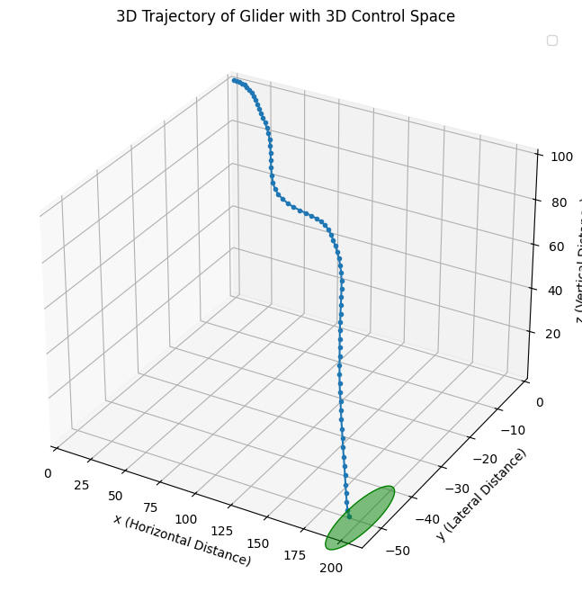

  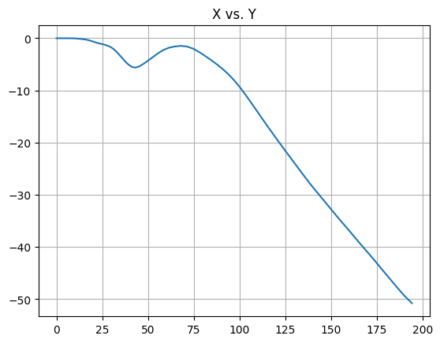

  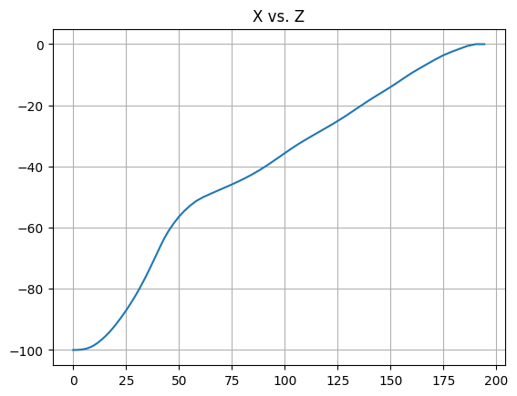

Figure 17: SST* 3D trajectory, x-y, and x-z trajectory with a control space of aileron, elevator, and rudder. **The number of SST* iterations is 3**. The goal is x = 200, y = -50. The goal region is a 10m radius around the goal. The cost function is designed to reduce the distance to the goal, prioritizing a straight-line path to goal.

  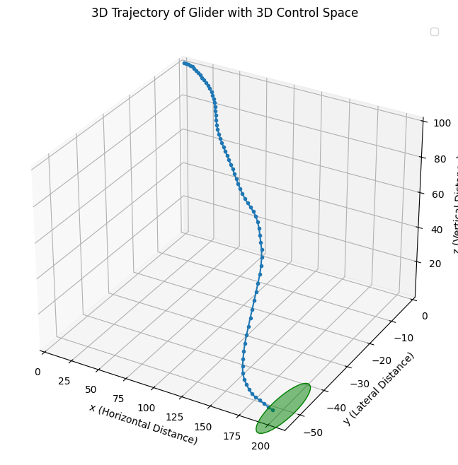

  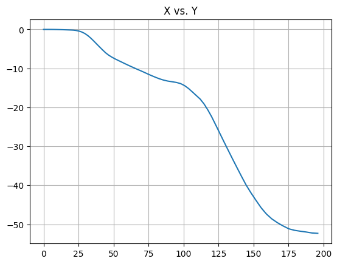

  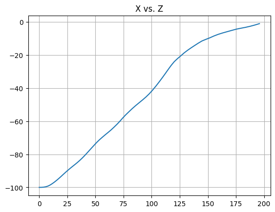

Figure 18: SST* 3D trajectory, x-y, and x-z trajectory with a control space of aileron, elevator, and rudder. **The number of SST* iterations is 30**. The goal is x = 200, y = -50. The goal region is a 10m radius around the goal. The cost function is designed to reduce the distance to the goal, prioritizing a straight-line path to goal.

  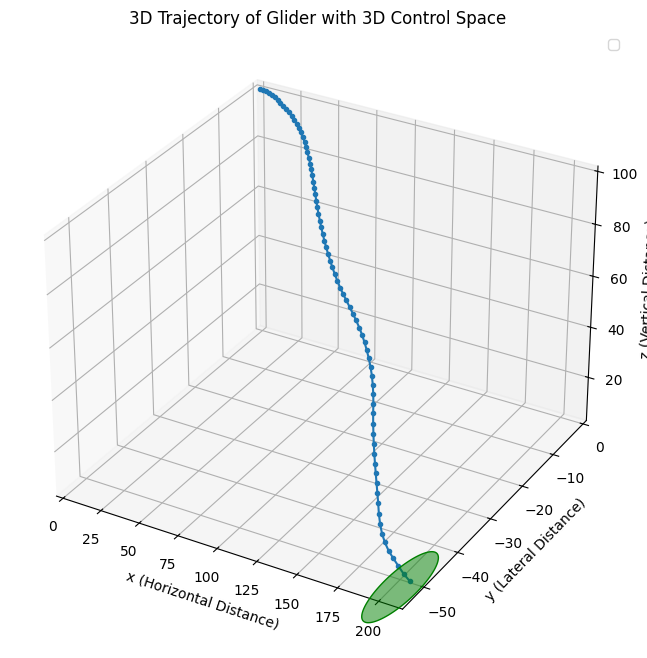

  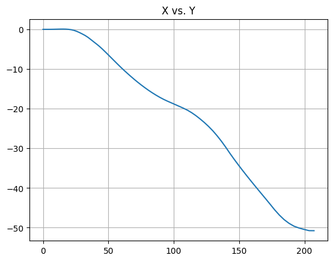

  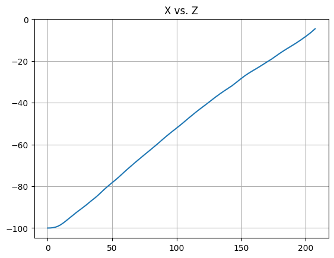

Figure 19: SST* 3D trajectory, x-y, and x-z trajectory with a control space of aileron, elevator, and rudder. **The number of SST* iterations is 300**. The goal is x = 200, y = -50. The goal region is a 10m radius around the goal. The cost function is designed to reduce the distance to the goal, prioritizing a straight-line path to goal.

Cost Function Analysis in 3D

I conducted a quick study on how the planner handles a rotation rate cost function in three dimensions. Figure 20 show the effectiveness of this cost function by comparing a plan with and without the cost function.  

  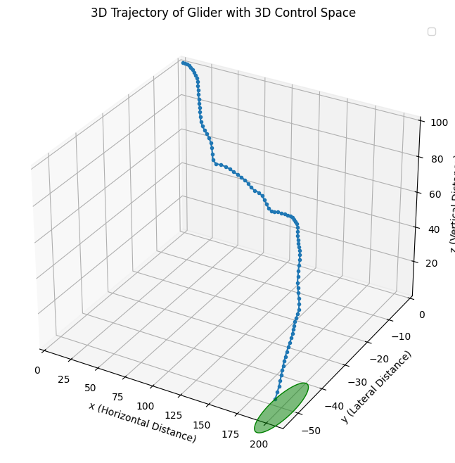

  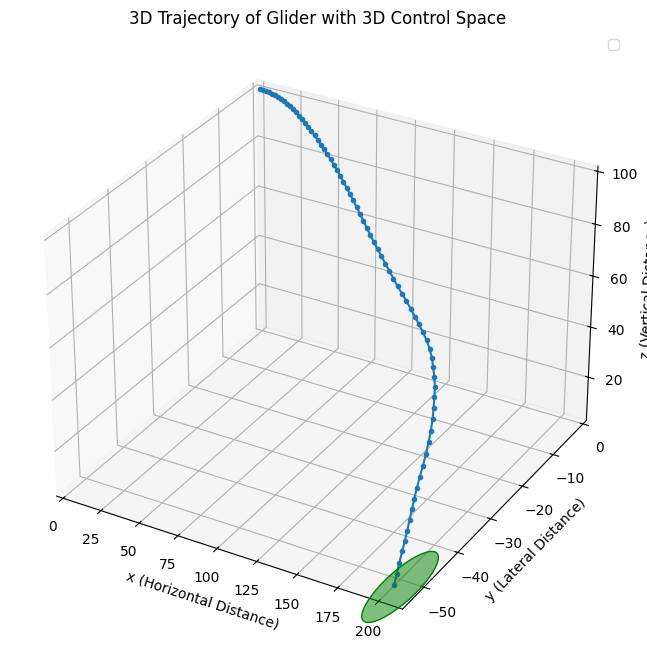

Figure 20: SST* 3D trajectory with a control space of aileron, elevator, and rudder. The image on the left shows the case where the planner has only a goal based cost function. The image on the right (with a smoother path) shows the case where the planner has a goal based cost function as well as a rotation rate cost based function.

## 5 Conclusion

This study has comprehensively evaluated the application of the Stable Sparse RRT* (SST*) algorithm for planning dynamically feasible trajectories of a glider in both two-dimensional (2D) and three-dimensional (3D) environments. By systematically incorporating obstacles and wind disturbances in the 2D case and extending the analysis to a more complex 3D spatial domain, the research underscores the versatility and robustness of SST* in diverse planning scenarios.

### 5.1 Key Findings

#### Two-Dimensional Environment

In the two-dimensional analysis, SST* was tasked with navigating a glider through environments populated with obstacles and subjected to uniform wind disturbances. The implementation demonstrated that:

• Cost Function Effectiveness: By analyzing a variety of cost functions, including range-centric, obstacle penalties, pitch-rate penalties, and altitude costs, SST* effectively guided the glider to maximize glide range and maintain stability without relying on explicit goal sampling.

• Autonomous Goal Discovery: The evaluation without explicit goal sampling revealed that SST* can autonomously discover optimal trajectories solely based on cost-based guidance. This capability highlights SST*’s potential to operate efficiently in scenarios where goal states are undefined or dynamic.

• Obstacle Avoidance and Stability: The incorporation of obstacle proximity and pitch-rate penalties ensured collision-free paths and smooth flight profiles, demonstrating SST*’s ability to balance multiple conflicting objectives effectively.

#### Three-Dimensional Environment

Extending the analysis to a three-dimensional environment introduced additional complexities, including increased state dimensionality and the necessity to account for yaw dynamics. The findings in this domain include:

• Enhanced Optimality: Through a series of iterative experiments, SST* exhibited convergence toward optimal trajectories in 3D space as the number of iterations increased and pruning thresholds were refined. This confirms the algorithm’s asymptotic optimality in higher-dimensional state spaces.

• Comprehensive Cost Function Analysis: The detailed examination of cost functions in 3D, encompassing goal-centric, range-centric, obstacle penalties, pitch-rate and yaw-rate penalties, and altitude and heading costs, provided deeper insights into SST*’s trajectory optimization capabilities. The ability to fine-tune these cost functions allowed for tailored trajectory planning that meets specific mission objectives.

• Robustness to Environmental Variations: The planner maintained optimal performance despite the increased complexity of the 3D environment, including navigating around obstacles and adjusting to dynamic wind conditions. This robustness underscores SST*’s applicability to real-world, multi-dimensional planning problems.

### 5.2 Implications

The successful implementation and evaluation of SST* in both 2D and 3D environments demonstrate its strong potential as an efficient and adaptable motion planning algorithm for autonomous glider navigation. The ability to operate without explicit goal sampling, relying instead on carefully designed cost functions, offers significant flexibility in scenarios where goal states are not well-defined or are subject to change. Additionally, SST*’s asymptotic optimality in 3D spaces positions it as a viable solution for complex spatial planning tasks beyond the scope of traditional RRT-based planners.

### 5.3 Conclusion

In summary, this report has demonstrated that the Stable Sparse RRT* algorithm is a powerful and flexible tool for autonomous glider trajectory planning in both two-dimensional and three-dimensional environments. Its ability to effectively navigate complex environments, optimize trajectories based on diverse cost functions, and approach asymptotic optimality in higher-dimensional spaces highlights its suitability for a wide range of motion planning applications.

### Acknowledgments

This is my bibliography, I really could not figure out why my .bib wasn’t transferring.

• Paper ”Asymptotically Optimal Sampling-based Kinodynamic Planning”.

• Book ”Dynamics of Flight Stability and Control”.

• ChatGPT for helping me code and write the paper.

• Professor Lahijanian, thanks for the lecture notes and knowledge.

• Thanks to my girlfriend for listening to all my rants about my code not working.

